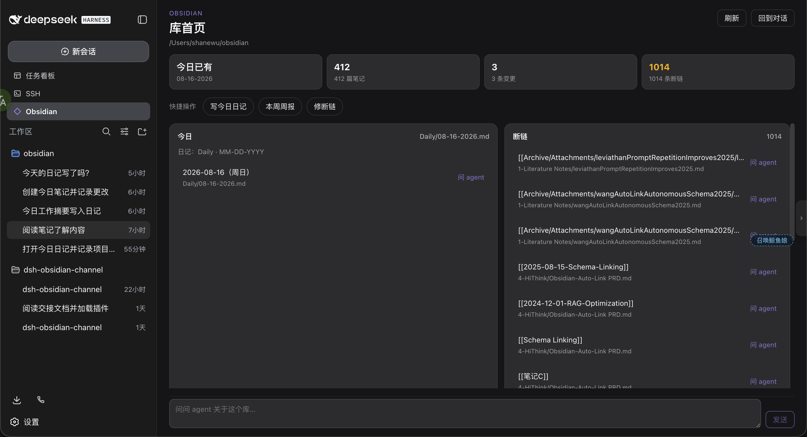
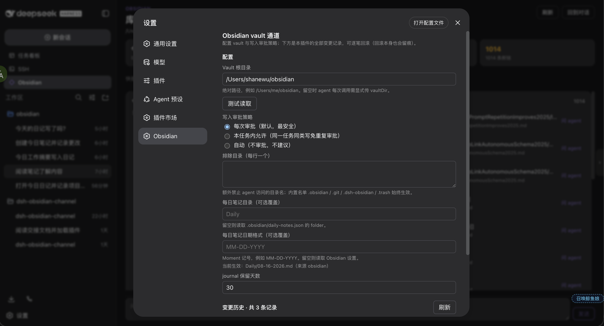

# dsh-obsidian-channel

English · [中文](docs/README.zh.md)

[](https://github.com/ShengenWu/dsh-obsidian-channel/releases)
[](https://github.com/deepseek-ai/deepseek-harness)
[](LICENSE)
[](https://nodejs.org)
[](https://github.com/topics/dsh-plugin)

Work with a local Obsidian vault from [DeepSeek Harness](https://github.com/deepseek-ai/deepseek-harness).

The 📓 button in the sidebar opens a home page for that vault. From there you can send the agent off to read a note, write today’s daily, or chase a broken wikilink. Writes ask you first. Anything this plugin changes can be rolled back. Obsidian itself does not need to be running.

## What you need

- **dsh web** installed and working
- Built against **dsh `0.1.0-rc.6`**
- A normal Obsidian vault folder on disk

## Install

```bash
dsh plugin --profile web add github:ShengenWu/dsh-obsidian-channel
```

Restart `dsh web` and open http://127.0.0.1:3080.

For a local checkout: `dsh plugin --profile web add /path/to/this/repo`.

## First run

1. Click 📓 **Obsidian** in the left sidebar.
2. If no vault is bound yet, paste the **absolute path** (`/Users/you/Notes` or `D:\Notes`) and bind it.
3. You get a home page: today’s daily, recently touched notes, changes this plugin made, broken links.
4. Click a note or a shortcut like “write today’s daily”. dsh opens a **new** session on that vault and drops text into the composer. It does not send for you.

The path is remembered. Later clicks only open the home page; they do not create another workspace.



## Day to day

**Talk from the home page.** Click a note, a broken link, or type at the bottom. Each click starts a fresh vault session so you are not dumped into last week’s thread.

**Daily notes follow Obsidian.** The home page and the agent read `.obsidian/daily-notes.json` first. If your vault uses `Daily` + `MM-DD-YYYY`, this plugin uses that path and will not invent another date order. Override it under Settings → Obsidian if you really want to.

**Writes wait for you.** Default is ask-every-time. You can switch to “ask once per task” or “never ask” (please don’t).

**Undo lives in Settings.** Settings → Obsidian has the change history: before / after, one-click rollback. A rollback is itself a journaled change, so you can undo the undo.

**Settings you actually care about:**

- vault path
- whether writes need approval
- daily-note folder and date format (optional; empty means “use Obsidian’s own setting”)
- extra directories the agent must not touch
- how long to keep the journal (30 days by default)



Vault sessions default to **Obsidian mode**: it does not change the mode on other workspaces. The persona is “help you tend a knowledge base”, not “write code”.

Reads can stay on the built-in read / grep / glob tools. Creates, replacements, appends, and deletes should go through the `obsidian_*` tools so they land in the journal. Native write / edit into this vault is blocked.

## What’s in 0.1.0

- [x] Sidebar entry and vault home (today / recent / changes / broken links / shortcuts)
- [x] Approved create, update, append, delete, and batch edits
- [x] Change journal and one-click rollback
- [x] Settings page (bind the vault, approval policy, daily habit)
- [x] Daily-note path taken from Obsidian’s own config
- [x] Obsidian mode as the default for vault sessions; vault guidance only when the session is actually in the vault
- [x] Native write / edit into the vault is rejected
- [ ] Daily / template / graph tools — cards from templates, weekly recap, orphan notes. The home page already lists broken links; there is no dedicated tool yet
- [ ] A cross-session skill — say “file today’s work in my daily note” from a coding session and have it hit the right vault with the journaled write path
- [ ] `[[` completion in the composer — pick notes by title while typing a wikilink

Known gap: `bash` can still rewrite files and skip the journal. Be careful in a vault session.

## License

[MIT](LICENSE)

Issues welcome: <https://github.com/ShengenWu/dsh-obsidian-channel/issues>
